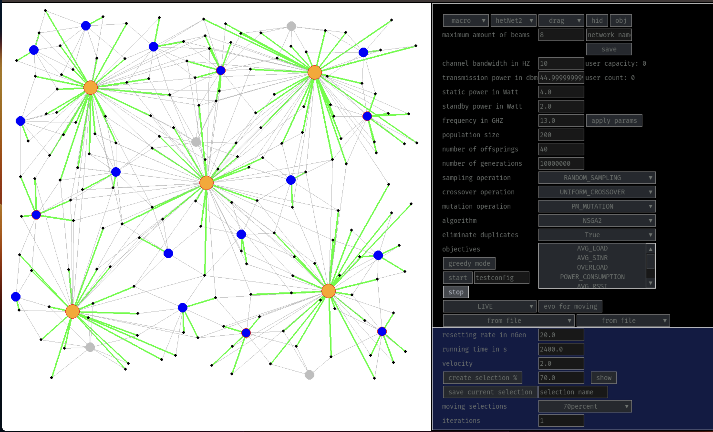

# SON-Simulation

A mobile Network simulation



## Requirements

- Python 3.9+

## How to install

### Run this command in a command prompt when using a normal python environment:

```
pip install -r pip-requirements.txt
```

### Run this command when using conda to create conda-environment with required packages

```
conda env create -f son-simulation-conda-env.yml
conda activate son-simulation-conda-env
```

## running normal interacitve UI-mode

just run

```
python pygame_editor.py
```

## example for running predefined experiments via script arguments

python network_simulation_script.py [network-name] [configuration-json-file-path]

```
python network_simulation_script.py test ./evo_only_config.json
```

make sure that a network with the corresponding name already exists before execution. Otherwise it won't work.

You will find the results inside a new folder with the name of the config-json-file-path parameter. This folder will appear in the directory of the corresponding network name of the run.

for the example above this would mean the results will appear in the folder datastore/test/evo_only_config/... after runtime.

## Run the software on the cluster

- Get your code onto the cluster
- Use the following to build the image (the .def file contains the container definition)

```
apptainer build nns.sif nns.def
```

- Use the `slurm_job.sh` to run the container on the cluster with the following command from the directory containing the code

```
sbatch slurm_job.sh
```

To change how the program is run, change either the `.def` file, or use

```
apptainer exec nns.sif COMMAND
```

in the `slurm_job.sh`.
